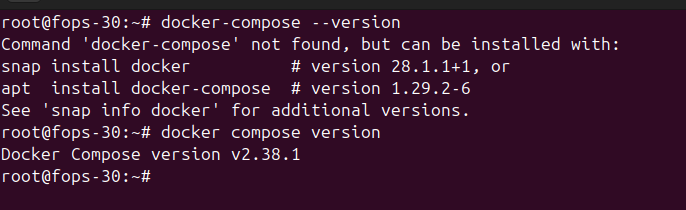
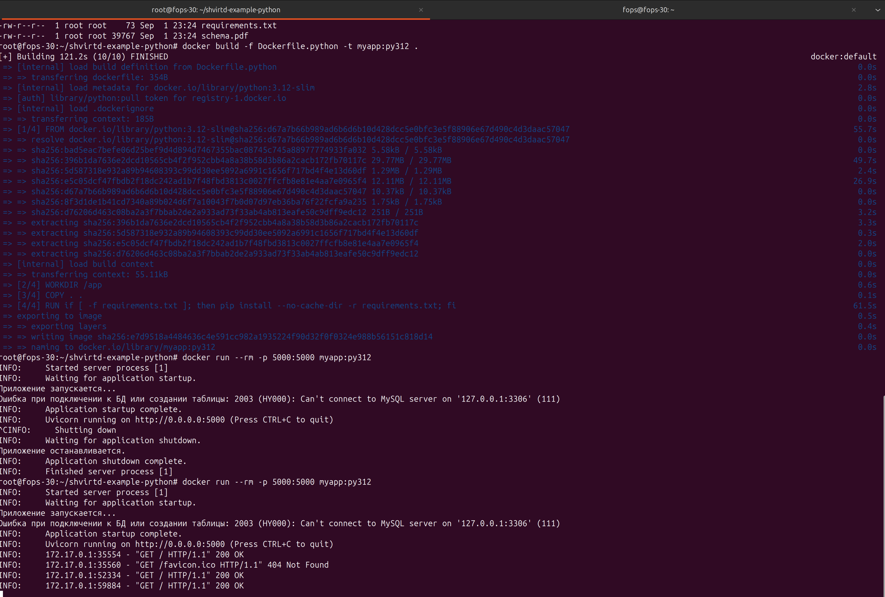
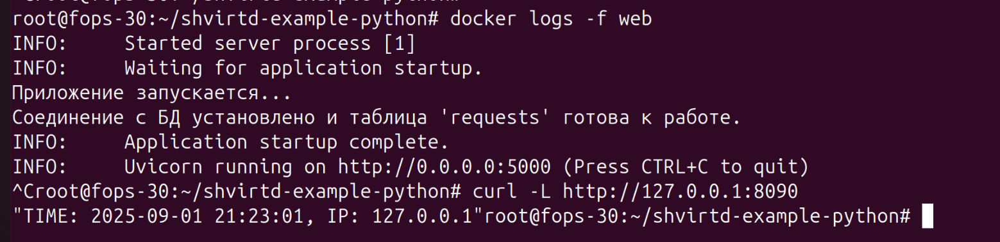
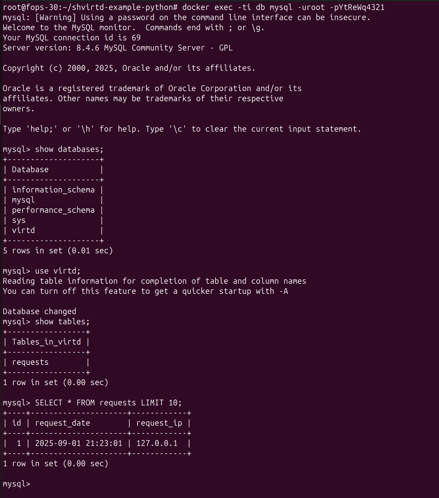
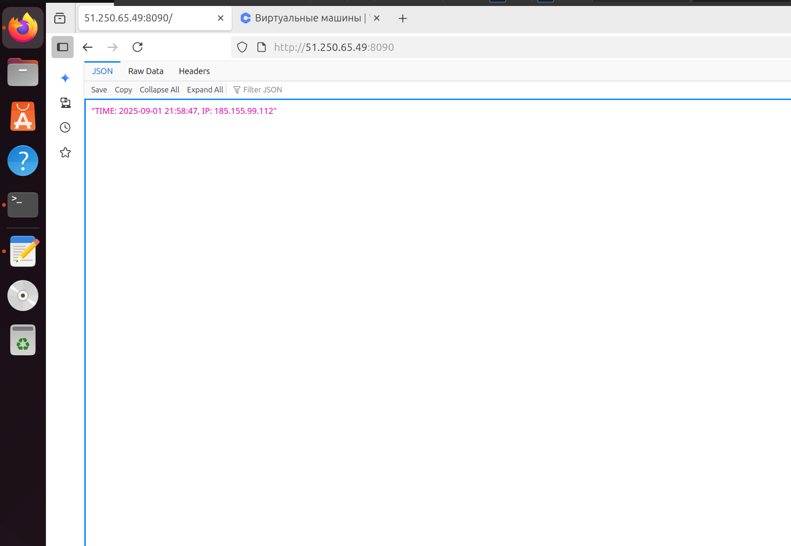
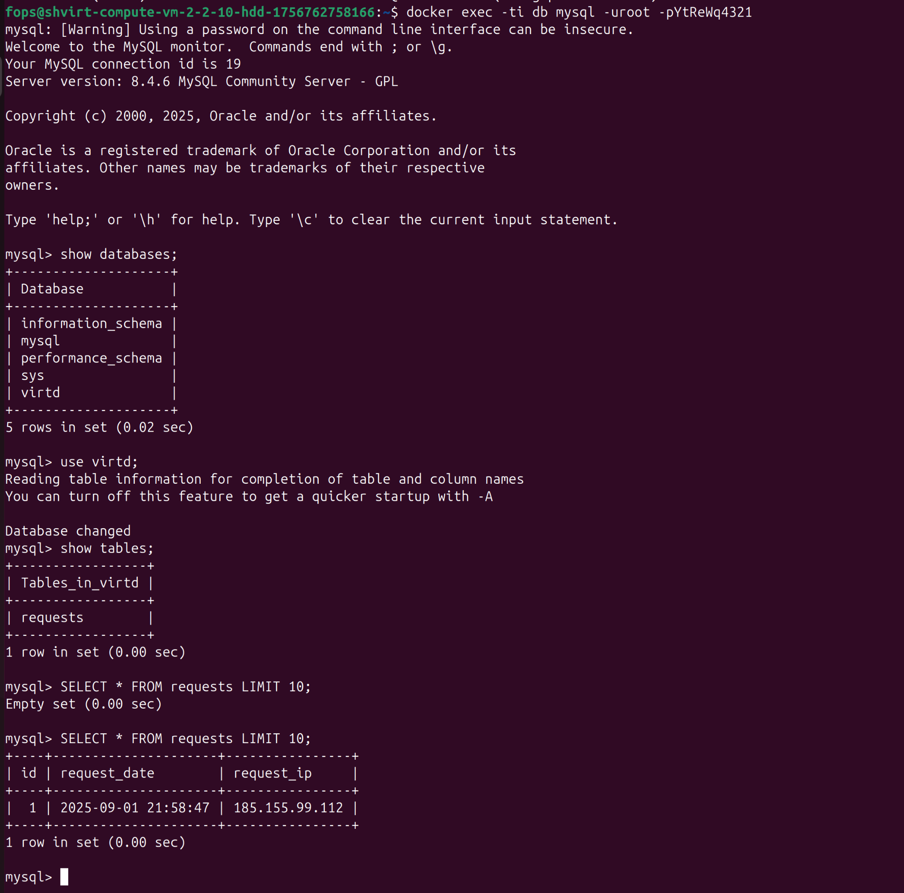
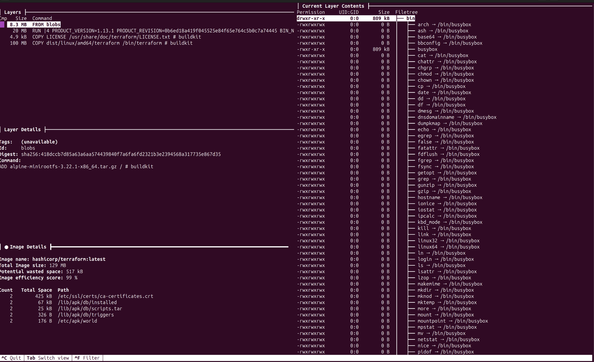
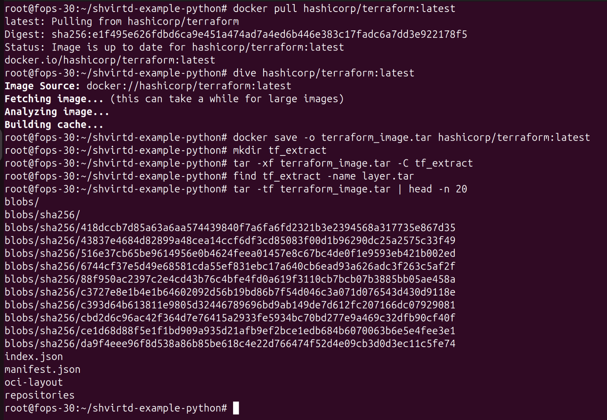
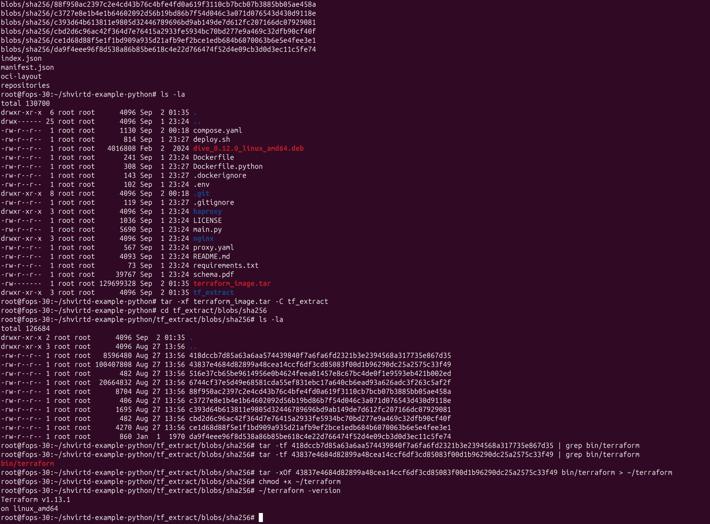
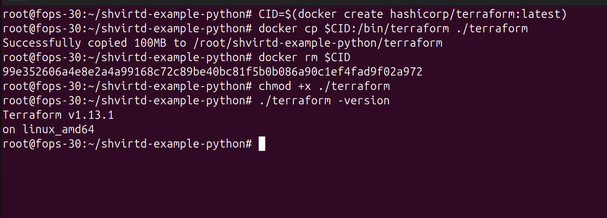

# Домашнее задание к занятию 5. «Практическое применение Docker»


## Задача 0

#### docker compose version



## Задача 2

#### Тест корректности сборки без docker compose


## Задача 3

#### локальный запуск с помощью docker compose



#### скрин SQL-запросов


## Задача 4

#### bash скрипт и запуск проекта целиком на Yandex Cloud ВМ
```
#!/usr/bin/env bash
set -euo pipefail

REPO_URL="${REPO_URL:-https://github.com/drumlast/shvirtd-example-python.git}"
TARGET_DIR="/opt/myapp"

echo "[*] Docker versions:"
docker --version
docker compose version

echo "[*] Clone/update repo to ${TARGET_DIR}..."
if [ -d "${TARGET_DIR}/.git" ]; then
  git -C "${TARGET_DIR}" fetch --all --prune
  git -C "${TARGET_DIR}" reset --hard origin/$(git -C "${TARGET_DIR}" rev-parse --abbrev-ref HEAD || echo main)
else
  sudo mkdir -p "${TARGET_DIR}"
  sudo chown -R "$USER":"$USER" "${TARGET_DIR}"
  git clone "${REPO_URL}" "${TARGET_DIR}"
fi

cd "${TARGET_DIR}"

if [ ! -f .env ]; then
  echo "Создайте .env с MYSQL_ROOT_PASSWORD, MYSQL_DATABASE, MYSQL_USER, MYSQL_PASSWORD"
  exit 1
fi

docker compose pull || true
docker compose up -d --build
docker compose ps
```




[Ссылка на форк](https://github.com/drumlast/shvirtd-example-python "Форк")

## Задача 6

#### Копирование бинарного файла /bin/terraform на локальную машину, используя dive и docker save




## Задача 6.1

#### Копирование бинарного файла /bin/terraform на локальную машину, используя docker cp
