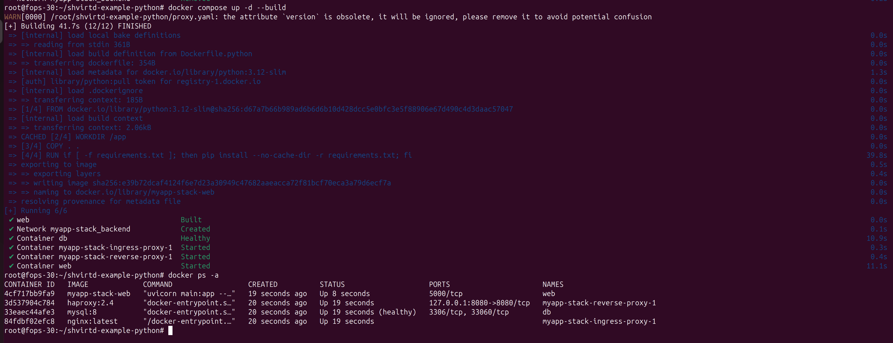
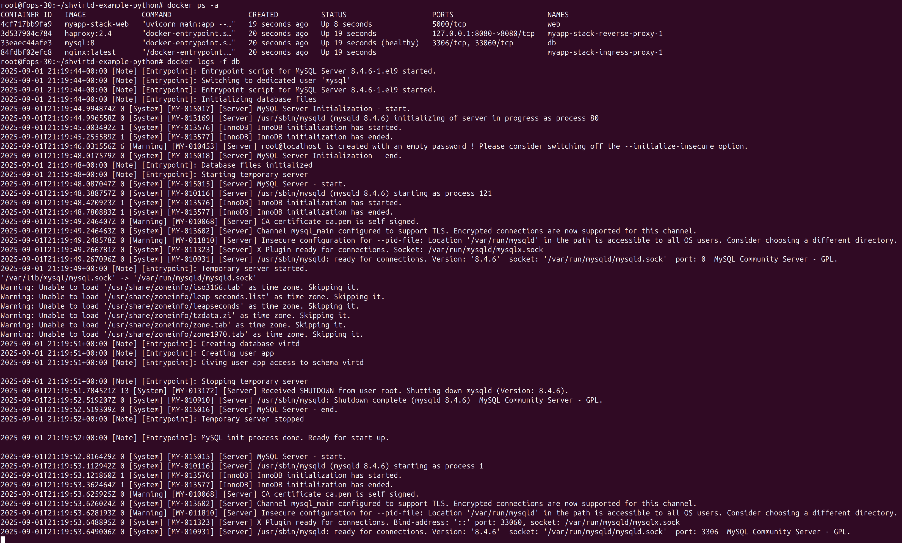

# Домашнее задание к занятию 5. «Практическое применение Docker»

## Задача 0

#### docker compose version

## Задача 2

#### Тест корректности сборки без docker compose

## Задача 3

#### локальный запуск с помощью docker compose

#### скрин SQL-запросов

## Задача 4

#### Запуск проекта целиком на Yandex Cloud ВМ

